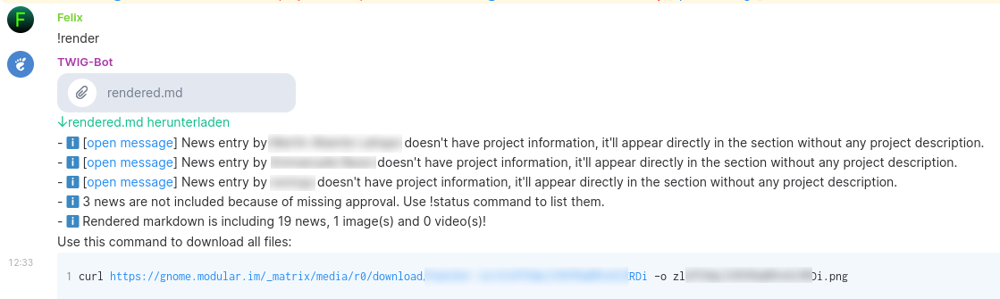
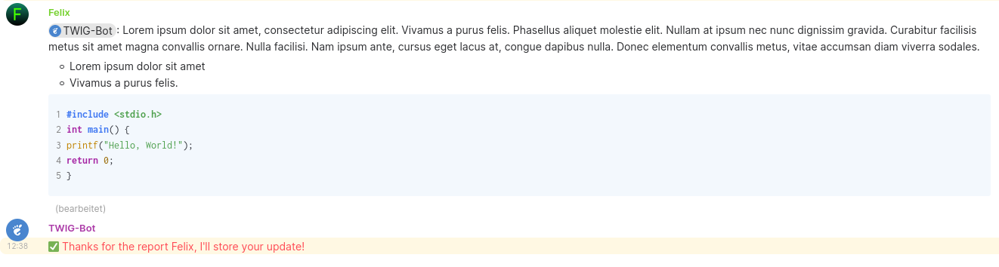

# hebbot

A [Matrix](matrix.org) bot which can help to generate periodic / recurrent summary blog posts (also known as "This Week in X"). 

The bot was inspired by [twim-o-matic](https://github.com/matrix-org/twim-o-matic/tree/master/data), and is developed in Rust using the [matrix-rust-sdk](https://github.com/matrix-org/matrix-rust-sdk). 

### Features
- Automatic recognition of news when the bot username is mentioned at the beginning of the message
- Approval of messages by a defined group of editors
- Messages can be sorted into projects / sections by using emoji reactions
- Support for images / videos
- Markdown generation (can be used for blogs, e.g. Hugo) 

### Screenshots



### Usage
Two Matrix rooms are required to use this bot.

#### "Reporting" room
This room is open to everyone. Here people can share news any time. Editors can mark messages, but also images and videos with emoji reactions here. For example...
- ⭕: Approve a message (to include it in the rendered markdown)
- 📷️: Add image. The image will then be automatically added to the corresponding news message, and inserted in the rendered markdown. 
- 🛰️: Add message to the third-party section

Those emojis are just an example, you can configure them as you want in the `config.toml` file. 

#### "Admin" room
In this closed room administrative commands can be executed.

| Command         | Description                                                |
| --------------- | ---------------------------------------------------------- |
| !about          | Shows bot version details                                  |
| !clear          | Clears all stored news                                     |
| !details "term" | Shows section/project details (term can be emoji or name)  |
| !list-config    | Lists current bot configuration                            |
| !list-projects  | Lists configured projects                                  |
| !list-sections  | Lists configured sections                                  |
| !render         | Creates a markdown file with the stored news               |
| !restart        | Restarts the bot, useful when you edited the configuration |
| !say "message"  | Sends a message in reporting room                          |
| !status         | Shows saved messages                                       |

### Configuration
In order to use the bot, two configuration files are required. The `config.toml` configuration file contains the bot settings (e.g. username/password, room ids, ...) and the definitions for the sections and projects. The second configuration file `template.md` serves as a template for the actual summary.

For both configuration files, examples are available that can be used as templates (`configuration/*.example` files). 

### Deployment
The bot is available as [docker image](https://hub.docker.com/r/haeckerfelix/hebbot).

Example docker-compose:

```
services:
  hebbot:
    image: haeckerfelix/hebbot:v2.1
    restart: unless-stopped
    volumes:
      - hebbot_data:/data
    environment:
      - CONFIG_PATH=/data/config.toml
      - TEMPLATE_PATH=/data/template.md
      - STORE_PATH=/data/store.json

volumes:
  hebbot_data:
```

The configuration files have to be placed in the `hebbot_data` volume.


### Example usage
Hebbot gets used to generate the weekly GNOME summaries ("This Week in GNOME"). More information, and usage examples can be found here: 
- https://blogs.gnome.org/haeckerfelix/2021/07/16/introducing-this-week-in-gnome/
- https://thisweek.gnome.org/
